# Coveted Cow

Welcome to the Coveted Cow README. This project is a full stack website 
based on the MERN (MongoDB, ExpressJS, React, NodeJS) stack that 
is used to create an eCommerce website that supplies cute, stuffed 
cows. You can access the website [here](https://coveted-cow.onrender.com/).

## Table of Contents
* Diagrams
* Backend
* Page Overview
  * Header/Navigation
  * Home
  * About
  * Catalog
  * Product Information
  * Login/Signup/Account
* Closure

## Diagrams
### Entity Relationship Diagram
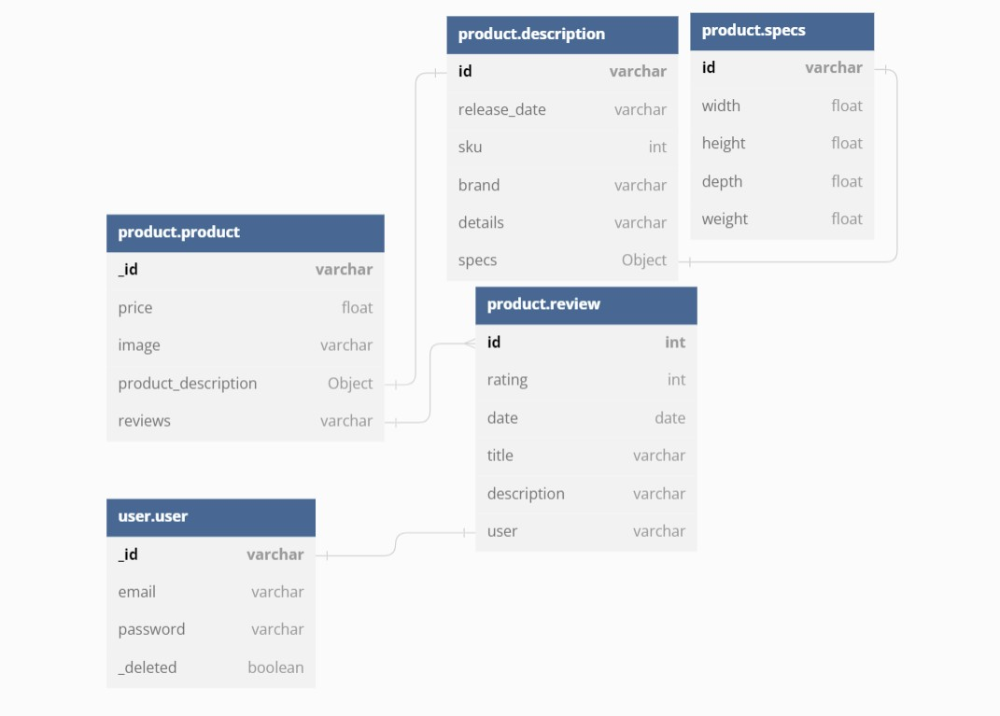

### Activity Diagrams
#### Review Submission
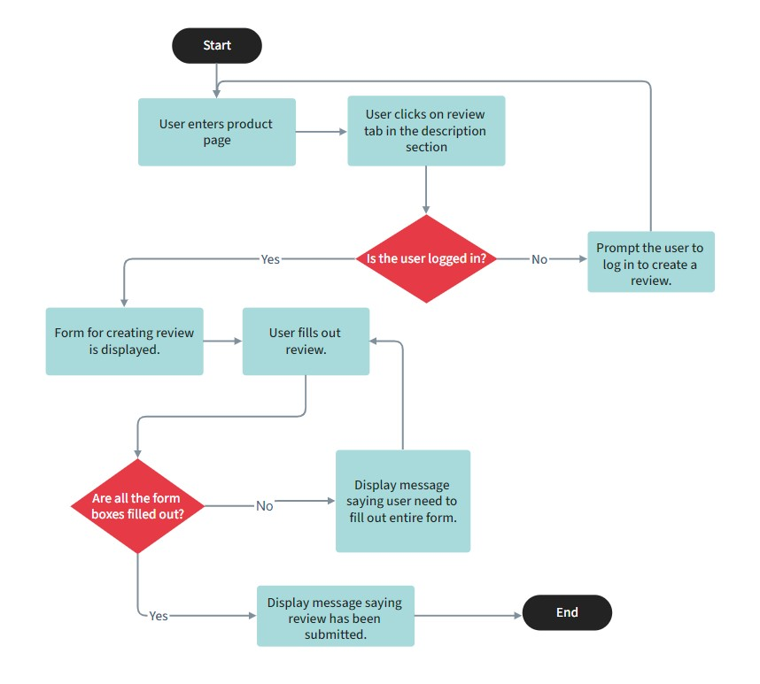

#### User Signup
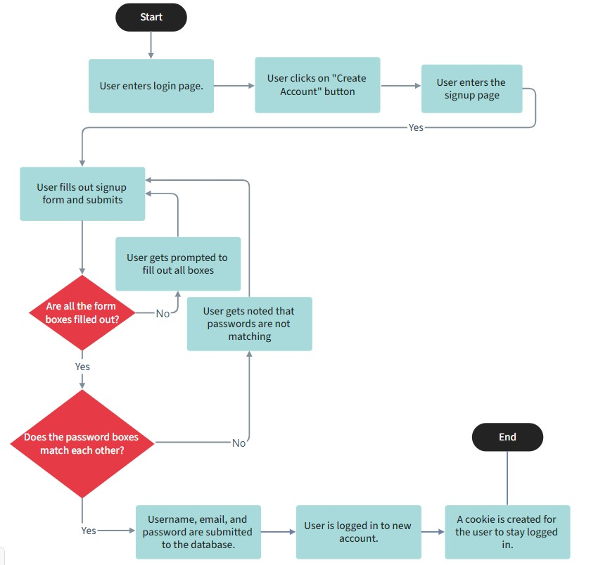

## Backend

The backend for this project is in a separate repository located
[here](https://www.google.ca). The backend uses ExpressJS, MongoDB,
 and NodeJS to create a REST API to communicate information 
with the frontend. The backend does the following utilities:
* Products
  * Retrieves all products
  * Retrieves specific products based on sorts, filters and search terms
  * Gets all unique brand names for filter purposes.
  * Submits reviews that users create
* Users
  * Creates or deletes a user
  * Verifies credentials to login a user
  * Sets a cookie that can keep a user logged in
  * Deletes the cookie when the user logs out.
  * Hashes and salts a password when the user creates an account or updates their password.

## Page Overview
### Header/Navigation
The header and navigation serve the same purpose on both desktop 
and mobile. They can do the following:
* Have navigation links to get to the catalog, about page, and account page.
* Have a link to login and logout of your account.
* Have access to the shopping cart in which you can manage the items in your shopping cart and checkout.
* Access a search bar that you can use to search for specific product.
* Click the site logo to go back to the home page.

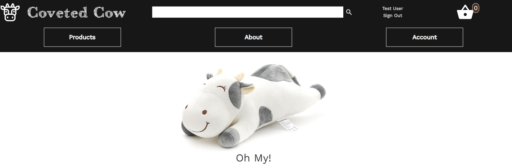
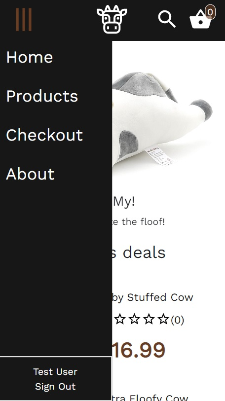

### Home
The home page contains a carousel and featured products and other information 
about the website. The home page is a page to welcome the user to the website 
and catch their attention.

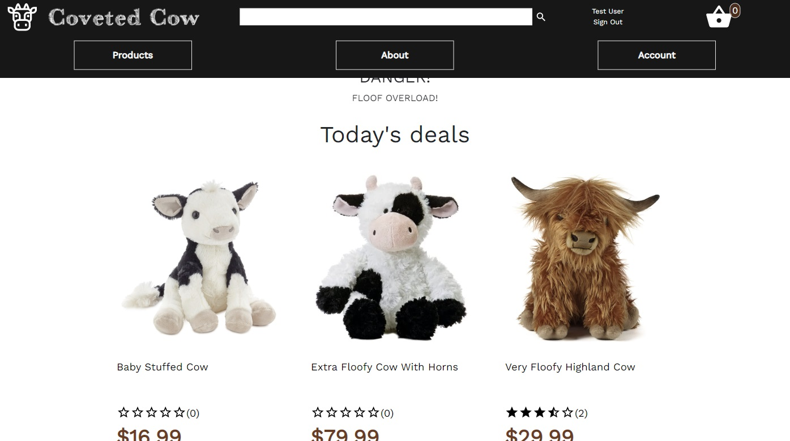
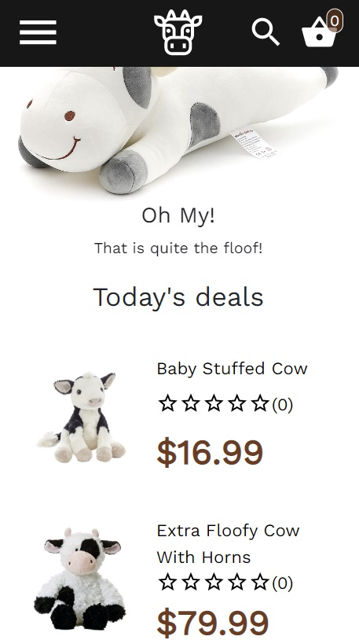

### About

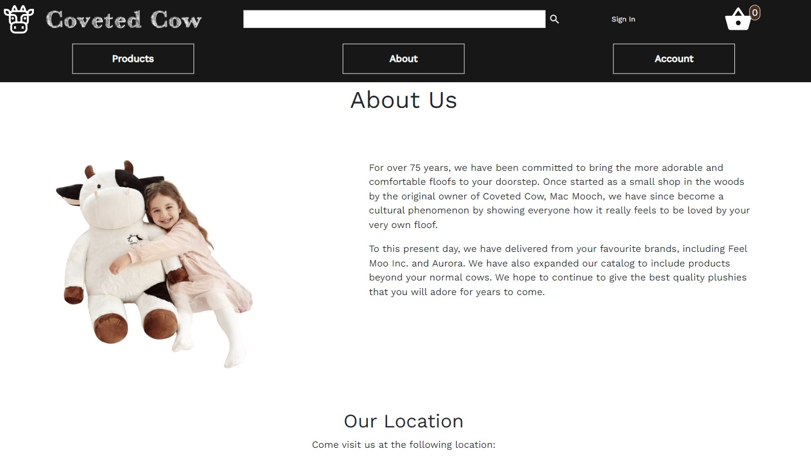
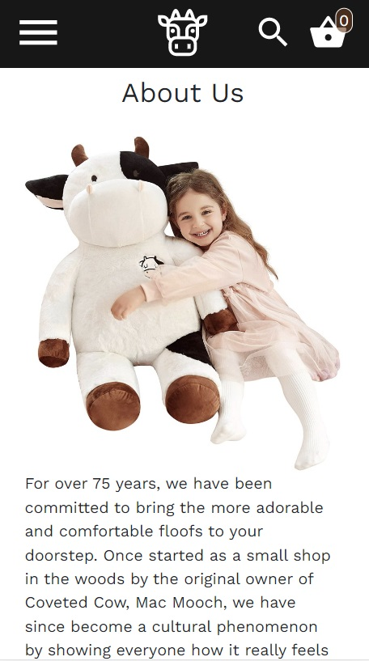

### Catalog

The catalog lists the products on sale. You can filter and sort 
the products by using the buttons on the sections containing 
the filters and sorts (side on desktop, top on mobile). Each 
product contains their name, price, review score, and an image 
of the product.

#### Default
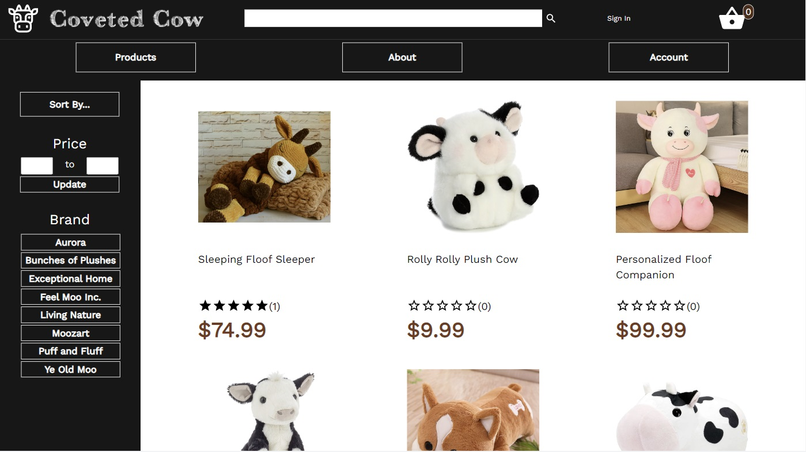
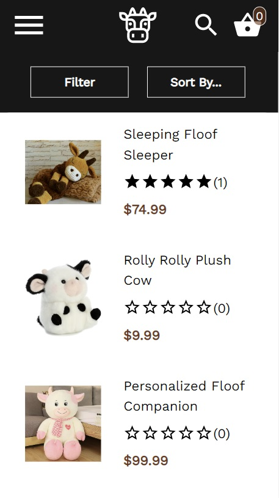

#### w/ Brand & $50-$100 Price Filters and Sort Low to High Price
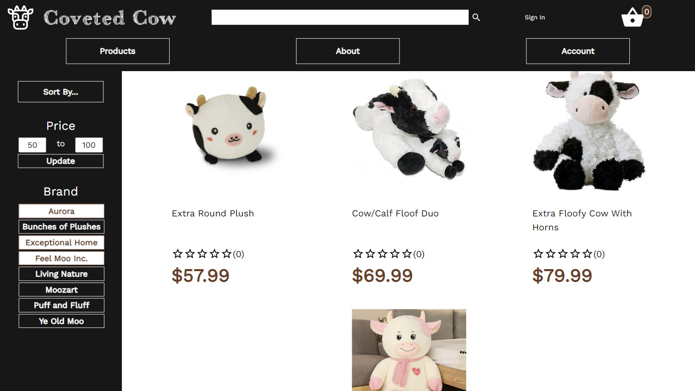
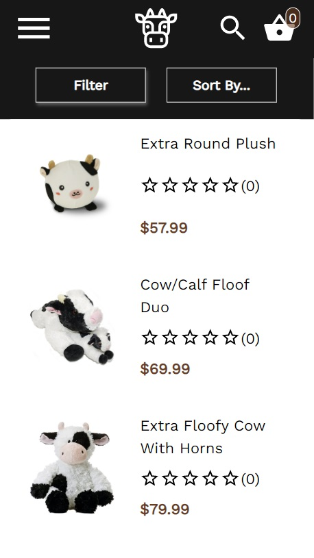

### Product Information

Upon clicking on a product, you will be taken to its respective page. 
On this page you will see further information about the product 
including the price, size of the product, reviews, and the ability 
to add a product to the shopping cart

Users can interact with this page by adding the quantity of the product 
and submitting it to the shopping cart. If the user is logged 
in, they also have the option to submit a review for a product.

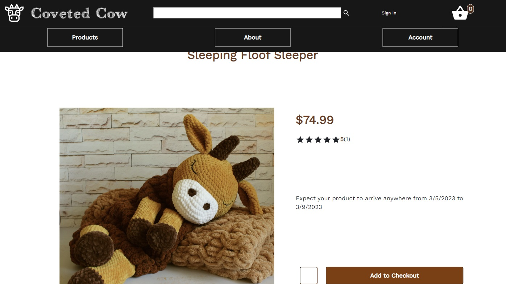
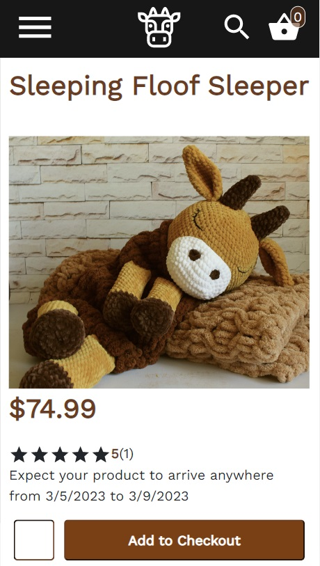

#### Reviews Section

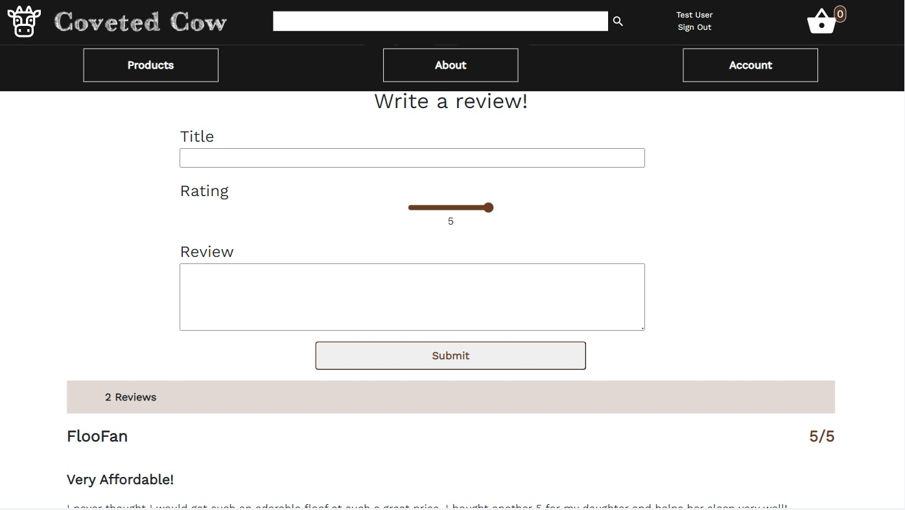
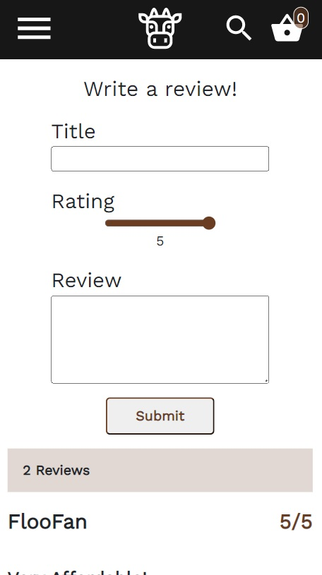

### Login/Signup/Account 
The main purpose of an account as it currently is, is to submit a review. 
The login, signup, and account pages are means of interacting 
with your account. The Login page logs you in to your account. 
The Signup page create a new account, and the Account page is 
a means of changing your password and deleting your account.

#### Login
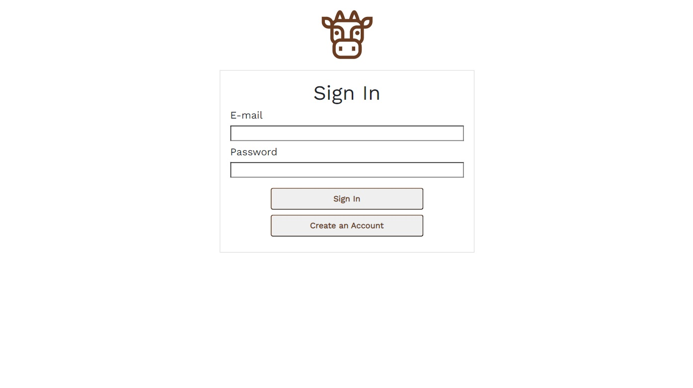

#### Signup
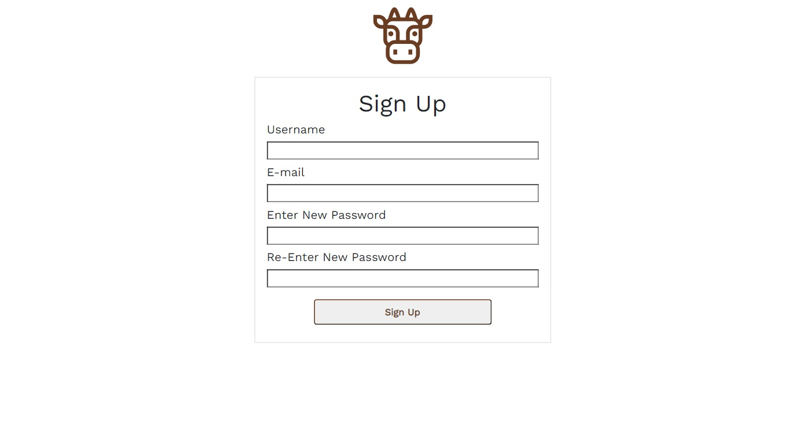

#### Account
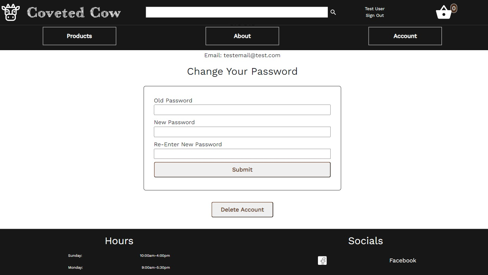

## Closure
Thanks for browsing this document. If you want to reach out to me,
please refer to my contact information and socials below.

Brett Orban | [Linkedin](https://www.linkedin.com/in/brett-orban-93994324a/) |
[Website]() | [Github](https://github.com/Bretty01) |
[Email](mailto:b3orban@gmail.com) |